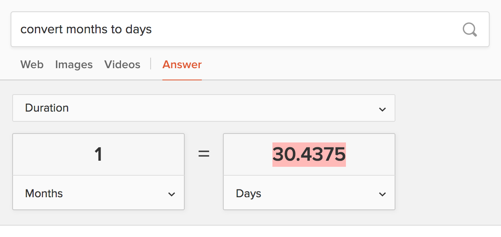

```{r include=FALSE}
knitr::opts_chunk$set(echo = TRUE)
# tcga_cell <- readRDS(here::here("data/tcga-cgds_prad-cell.rds"))
```

## Load Data

```{r library, message=FALSE, warning=FALSE}
library(tidyverse)
library(different)
```

The data come from **CGDS** -- [cBioPortal (TCGA, Provisional)](http://www.cbioportal.org/study?id=prad_tcga#summary) -- and **Liu2018** -- [Liu et. al., Cell (2018)](https://doi.org/10.1016/j.cell.2018.02.052).

Both are reproduced in [github.com/gerkelab/TCGApipelines](https://github.com/GerkeLab/TCGApipelines).

```{r }
tcga_liu2018 <- readRDS(here::here("data/tcga-liu2018_clinData.rds"))
tcga_cgds <- readRDS(here::here("data/tcga-cgds_prad.rds"))
```

**Liu2018** contains multiple cancer types, so we need to filter down to `"PRAD"`.

```{r }
tcga_liu2018 <- filter(tcga_liu2018, type == "PRAD")
```

Quick look at the dimensions of both datasets.

```{r }
list(
   Liu2018 = tcga_liu2018,
   CGDS = tcga_cgds
) %>% 
   purrr::map(~ setNames(dim(.), c("Rows", "Columns"))) %>% 
   purrr::transpose() %>% purrr::transpose() %>% 
   purrr::map_dfr(~ ., .id = "Set")
```

## Match ID Column

The columns containing IDs have different column names and format, so we first need to standardize name and format so that we can match patients from **CGDS** to those in **Liu2018**.

```{r }
tcga_liu2018 %>% slice(1:5) %>% select(bcr_patient_barcode)
tcga_cgds %>% slice(1:5) %>% select(id)
```

In general, it seems that **Liu2018** drops the trailing `.NN` and replaces
`.` with `-` characters. Here's a quick function that transforms the IDs.

```{r }
cgds_to_liu2018_id <- function(ids) {
   ids <- str_remove(ids, "\\.\\d{2}$")
   str_replace_all(ids, "\\.", "-")
}
```

Verify this function gives thes same format for both IDs.

```{r }
tcga_liu2018$bcr_patient_barcode[1]
cgds_to_liu2018_id(tcga_cgds$id[1])
```

### Trailing `.NN` in CGDS

The IDs in the **CGDS** dataset contain a trailing `.NN`. Are these always `.01`?

```{r }
tcga_cgds %>% 
   select(id) %>% 
   mutate(`Trailing Digits` = str_extract(id, "\\d{2}$")) %>% 
   group_by(`Trailing Digits`) %>% 
   count() %>% 
   knitr::kable()
```

Which ID ends with `.06`?

```{r }
cgds_odd_id <- tcga_cgds %>% 
   filter(str_detect(id, "06$")) %>% 
   pull(id)

cgds_odd_id
```

Is this ID otherwise unique?

```{r }
cgds_odd_data <- tcga_cgds %>% 
   filter(str_detect(id, str_remove(cgds_odd_id, "\\.\\d{2}$"))) %>% 
   select(1:10)

knitr::kable(cgds_odd_data)
```

Are there differences in this data?

```{r }
different::tidy_diff(cgds_odd_data[1, ], cgds_odd_data[2, ])
```

The only difference in the **CGDS** data between the patients with these IDs is the ID itself.
Does this ID appear in the **Liu2018** data?

```{r }
tcga_liu2018 %>% 
   filter(bcr_patient_barcode %in% cgds_to_liu2018_id(cgds_odd_id)) %>% 
   select(1:5) %>%
   knitr::kable()
```

Okay, so we'll drop the duplicated patient from CGDS with the `.06` ID.

```{r }
tcga_cgds <- tcga_cgds %>%
   filter(id != cgds_odd_id)
```

### Match CGDS IDs to Liu2018

```{r }
tcga_cgds <- tcga_cgds %>%
   mutate(id = cgds_to_liu2018_id(id)) %>% 
   rename(bcr_patient_barcode = id)
```

**Liu2018** contains two additional participants not included in the **CGDS** dataset:

```{r }
tcga_liu2018 %>% 
   filter(!bcr_patient_barcode %in% tcga_cgds$bcr_patient_barcode) %>% 
   select(bcr_patient_barcode, type, last_contact_days_to) %>% 
   knitr::kable()
```

So we'll remove those patients for the remainder of this comparison.

```{r }
tcga_liu2018 <- tcga_liu2018 %>%
   filter(bcr_patient_barcode %in% tcga_cgds$bcr_patient_barcode)
```

## First look at differences

First, we arrange both datasets by ID so that their rows are aligned.

```{r }
tcga_cgds <- arrange(tcga_cgds, bcr_patient_barcode)
tcga_liu2018 <- arrange(tcga_liu2018, bcr_patient_barcode)
```

From here, we'll use a package we are currently developing for comparing and resolving the differences between data sets, called `different`.

We'll use this package for a first look at the differences between **CGDS** and **Liu2018** and then we'll try to resolve these differences by uncovering the steps required to transform **CGDS** to be as close as possible to **Liu2018**.

```{r }
tcga_diff <- tidy_diff(tcga_cgds, tcga_liu2018)

summary(tcga_diff)
```

## Matching Columns

At this point, there are many more columns in **CGDS** and the names are not the same for most of these.
The `r length(intersect(colnames(tcga_cgds), colnames(tcga_liu2018)))` columns with the same names were automatically matched.
The remaining columns were matched via rules that were generated by comparing columns by hand, by visually inspecting values, etc.

```{r match-rules}
source(here::here("docs/compare-cgds-vs-liu2018/match_rules.R"))
match_rules
```

Two datasets are then created that match the "overlap" between the original datasets.
The matched datasets now have the same number of columns, the same column names and the same number of rows.

```{r merging}
tcga_liu2018_matched <- tcga_liu2018[, match_rules$liu2018]
colnames(tcga_liu2018_matched) <- match_rules$merged

tcga_cgds_matched <- tcga_cgds[, match_rules$cgds]
colnames(tcga_cgds_matched) <- match_rules$merged

tcga_diff <- tidy_diff(tcga_cgds_matched, tcga_liu2018_matched)
summary(tcga_diff)
```

But there are still a lot of differences between the two datasets.
Each point below indicates a miss between the two -- i.e. a value that is not the same in both data sets.

```{r diff-plot}
plot(tcga_diff)
```

## Transformations

```{r echo=FALSE}
vars_totally_different <- filter(tcga_diff$diff, miss_count >= 400)$variable
```

As seen in the previous plot, there are `r length(vars_totally_different)` columns that are completely different across all or nearly all observations.
This is most likely the result of recoding categorical variables (e.g. `1` vs `Deceased`)
or of a difference in units (e.g. *months* vs *days*).

The plot below compares the values of a column from **CGDS** to its corresponding value in **Liu2018** when they are not the same in both.

```{r fig.height=10, fig.width=16, echo=FALSE}
tcga_diff$tidy[vars_totally_different] %>%
  imap(~ ggplot(.x) + 
          aes(x = value.x, y = value.y) + 
          geom_point() + 
          labs(x = tcga_diff$meta$names["x"], 
               y = tcga_diff$meta$names["y"], 
               title = .y)
  ) %>%
  cowplot::plot_grid(plotlist = ., ncol = 4)
```

### Convert Months to Days

Of the variables that are completely different one results from a scaling difference.

```{r }
OS.time_lm <- tcga_diff$tidy$OS.time %>% lm(value.y ~ value.x, data = .)
OS.time_lm
```

Looks like this is a result of converting overall survival time from months (decimal)
to days (integer).
Here's the first search result for *how to convert months to days*.



Rounding like this is destructive, so we can only modify the value expressed
in months (as a decimal) to be able to compare with the number of days (integer).

Once we make this transformation, all differences in our data dissappear.

```{r echo=FALSE}
ggplot(tcga_diff$tidy$OS.time) +
   aes(x = value.x, y = value.y - round(value.x * 30.4375), 0) +
   geom_point() + 
   labs(x = "CGDS Overall Survival Time [months]", 
        y = "Liu [days] - CGDS [months \U2192 days]",
        title = "round(CGDS [days] * 30.4375, 0)")
```

After review, this change is made to the **CGDS** data.

```{r }
tcga_cgds_matched <- tcga_cgds_matched %>%
  mutate(OS.time = round(OS.time * 30.4375, 0))
```

### Categorical Transformations

Now we can convert the categorical differences.
Here are three examples of the recoding that takes place.

```{r echo=FALSE}
diff_colnames <- c("Value in Liu2018", "Value in CGDS", "n")
```

```{r echo=FALSE, results='asis'}
tcga_diff$tidy %>% 
   .[vars_totally_different[-length(vars_totally_different)]] %>% 
   map(~ group_by(., value.y, value.x) %>% 
              count() %>%
              mutate_if(is.double, function(x) paste(round(x, 4))) %>% 
              mutate_all(as.character),
           .id = "variable") %>% 
   .[1:3] %>% 
   iwalk(~ cat(
      paste0("\n\n#### `", .y, "`\n\n"),
      knitr::kable(.x, col.names = diff_colnames), 
      sep = "\n"))
```

The following encodes the rules to move from the **CGDS** dataset
to the **Liu2018** dataset.

```{r }
tcga_cgds_matched <- tcga_cgds_matched %>%
   mutate(
      type = "PRAD",
      gender = toupper(gender),
      OS = as.integer(OS == "DECEASED"),
      race = case_when(
         race == "" ~ "[Not Available]",
         TRUE ~ race
      )
   )

tcga_liu2018_matched <- tcga_liu2018_matched %>%
  mutate(
     clinical_stage = NA,
     cause_of_death = case_when(
        vital_status == "Alive" ~ "",
        TRUE ~ cause_of_death
     )
  )
```

## Final Diff

```{r }
tcga_diff <- tidy_diff(tcga_cgds_matched, tcga_liu2018_matched)
summary(tcga_diff)
```

## Final Differences Report

### Omissions

The `clinical_stage` and `residual_tumor` columns were included in the Liu2018 dataset, but the values were replaced with `[Not Applicable]`.

### Transformations

The following columns were transformed from their original presentation in **CGDS** to **Liu2018** via the transformations listed below.

- `os_months` was converted to `OS.time` by multiplying by 30.4375 and rounding to the nearest integer.
- `cancer_type` was renamed `type` and replaced with the short form `PRAD`
- `sex` was renamed `gender` and made uppercase
- `os_status` was renamed `OS` and coded as an integer where `1 == "DECEASED"`
- `race` was coded as `"[Not Available]"` if not supplied in the CGDS dataset
- `patient_death_reason` was renamed `cause_of_death` and was coded as `"[Not Availble]"` when blank in the original dataset (including for patients who were still alive)

### Updates
 
The following variables were updated in the Liu2018 dataset.

```{r}
blank_or_missing <- function(x) {
   x[x == ""] <- "*blank*"
   x[x == " "] <- "*blank*"
   x[is.na(x)] <- "*missing*"
   x
}
```

#### `last_contact_days_to`

It's really not clear to me how this was updated.

```{r echo=FALSE, warning=FALSE}
left_join(tcga_liu2018_matched, tcga_cgds_matched, by = "bcr_patient_barcode",
          suffix = c(".liu", ".cgds")) %>% 
   # select(bcr_patient_barcode, starts_with("last_contact_days_to")) %>% 
   mutate(diff = last_contact_days_to.liu - last_contact_days_to.cgds) %>% 
   ggplot() +
   aes(x = bcr_patient_barcode, color = vital_status.liu, y = diff) +
   geom_point() +
   theme(axis.text.x = element_blank())
```

#### `treatment_outcome_first_course`

Liu2018 appears to have updated a large number of the values that were previously blank in CGDS.

```{r echo=FALSE}
tcga_diff$tidy %>% 
   .["treatment_outcome_first_course"] %>% 
   map(~ group_by(., value.y, value.x) %>% 
          count() %>%
          mutate_if(is.double, function(x) paste(round(x, 4))) %>% 
          mutate_all(as.character) %>% 
          ungroup() %>% 
          mutate_all(blank_or_missing),
       .id = "variable") %>% 
   knitr::kable(col.names = diff_colnames)
```

#### `tumor_status`

Similarly, tumor status was updated as well.


```{r echo=FALSE}
tcga_diff$tidy %>%
   .["tumor_status"] %>% 
   map(~ group_by(., value.y, value.x) %>% 
          count() %>%
          mutate_if(is.double, function(x) paste(round(x, 4))) %>% 
          mutate_all(as.character) %>% 
          ungroup() %>% 
          mutate_all(blank_or_missing),
       .id = "variable") %>% 
   knitr::kable(col.names = diff_colnames)
```

#### `cause_of_death`


```{r echo=FALSE}
tcga_diff$tidy %>% 
   .["cause_of_death"] %>% 
   map(~ group_by(., value.y, value.x) %>% 
          count() %>%
          mutate_if(is.double, function(x) paste(round(x, 4))) %>% 
          mutate_all(as.character) %>% 
          ungroup() %>% 
          mutate_all(blank_or_missing),
       .id = "variable") %>% 
   knitr::kable(col.names = diff_colnames)
```

#### `death_days_to`

```{r echo=FALSE}
tcga_diff$tidy %>% 
   .["death_days_to"] %>% 
   map(~ group_by(., value.y, value.x) %>% 
          count() %>%
          mutate_if(is.double, function(x) paste(round(x, 4))) %>% 
          mutate_all(as.character) %>% 
          ungroup() %>% 
          mutate_all(blank_or_missing),
       .id = "variable") %>% 
   knitr::kable(col.names = diff_colnames)
```

#### `new_tumor_event_dx_days_to`

Values missing in CGDS are at y-axis, values missing in Liu2018 are on x-axis.

```{r echo=FALSE}
tcga_diff$tidy$new_tumor_event_dx_days_to %>%
  mutate(missing = case_when(
     is.na(value.x) ~ "CGDS",
     is.na(value.y) ~ "Liu2018",
     TRUE ~ "Present in Both"
  )) %>% 
  mutate_at(vars(starts_with("value")), function(x) ifelse(is.na(x), 0, x)) %>%
  ggplot(aes(x = value.x, y = value.y, color = missing)) + 
   geom_point() +
   labs(x = "Value of new_tumor_event_dx_days_to in CGDS",
        y = "Value of new_tumor_event_dx_days_to in Liu2018")
```

