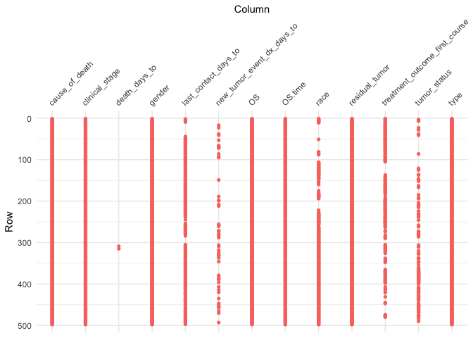
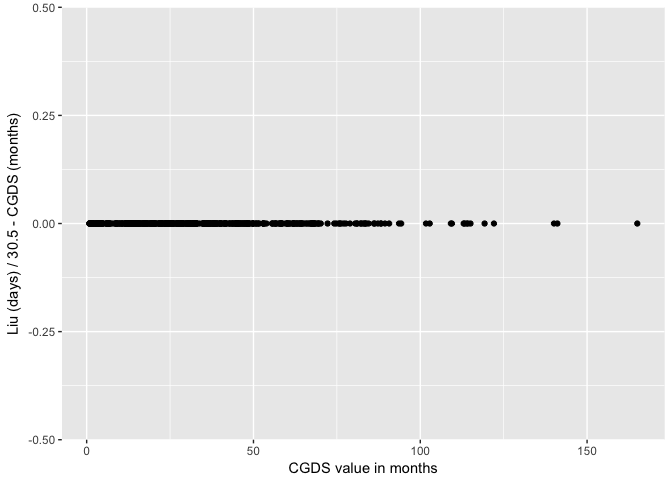
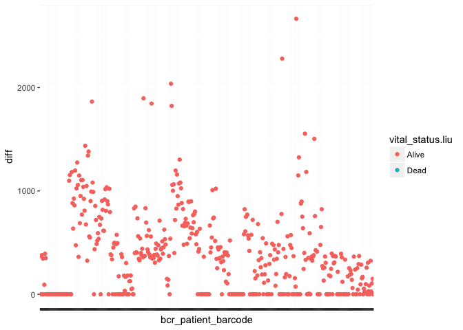
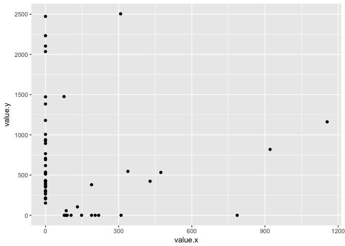

readme.R
================
garrickaden-buie
Thu Jul 5 17:09:55 2018

``` r
library(tidyverse)
library(different)
```

## Load Data

``` r
tcga_liu2018 <- readRDS(here::here("data/tcga-liu2018_clinData.rds"))
```

    ## Warning in readLines(f, n): line 1 appears to contain an embedded nul

    ## Warning in readLines(f, n): incomplete final line found on '/Volumes/CHUSF/
    ## moffitt/work/TCGApipelines/._TCGApipelines.Rproj'

``` r
tcga_cgds <- readRDS(here::here("data/tcga-cgds_prad.rds"))
```

Liu 2018 contains multiple cancer types. We need to filter down to
`"PRAD"`.

``` r
tcga_liu2018 <- filter(tcga_liu2018, type == "PRAD")
```

Quick look at dimensions

``` r
dim(tcga_liu2018)
```

    ## [1] 500  33

``` r
dim(tcga_cgds)
```

    ## [1] 499  80

## Match ID Column

Columns containing IDs have different column names and format.

``` r
tcga_liu2018 %>% slice(1:5) %>% select(bcr_patient_barcode)
```

    ## # A tibble: 5 x 1
    ##   bcr_patient_barcode
    ##   <chr>              
    ## 1 TCGA-2A-A8VL       
    ## 2 TCGA-2A-A8VO       
    ## 3 TCGA-2A-A8VT       
    ## 4 TCGA-2A-A8VV       
    ## 5 TCGA-2A-A8VX

``` r
tcga_cgds %>% slice(1:5) %>% select(id)
```

    ## # A tibble: 5 x 1
    ##   id             
    ##   <chr>          
    ## 1 TCGA.V1.A9OQ.01
    ## 2 TCGA.V1.A8MK.01
    ## 3 TCGA.XK.AAJT.01
    ## 4 TCGA.EJ.5502.01
    ## 5 TCGA.YJ.A8SW.01

In general, it seems that Liu 2018 drops the trailing `.NN` and replaces
`.` with `-` characters. Here’s a quick function that transforms the
IDs.

``` r
cgds_to_liu2018_id <- function(ids) {
   ids <- str_remove(ids, "\\.\\d{2}$")
   str_replace_all(ids, "\\.", "-")
}
```

Verify this function gives thes same format for both IDs.

``` r
tcga_liu2018$bcr_patient_barcode[1]
```

    ## [1] "TCGA-2A-A8VL"

``` r
cgds_to_liu2018_id(tcga_cgds$id[1])
```

    ## [1] "TCGA-V1-A9OQ"

The IDs in the CGDS dataset contain a trailing `.NN`. Are these always
`.01`?

``` r
tcga_cgds %>% 
   select(id) %>% 
   mutate(`Trailing Digits` = str_extract(id, "\\d{2}$")) %>% 
   group_by(`Trailing Digits`) %>% 
   count() %>% 
   knitr::kable()
```

| Trailing Digits |   n |
| :-------------- | --: |
| 01              | 498 |
| 06              |   1 |

Which ID ends with `.06`?

``` r
cgds_odd_id <- tcga_cgds %>% 
   filter(str_detect(id, "06$")) %>% 
   pull(id)

cgds_odd_id
```

    ## [1] "TCGA.V1.A9O5.06"

Is this ID otherwise unique?

``` r
cgds_odd_data <- tcga_cgds %>% 
   filter(str_detect(id, str_remove(cgds_odd_id, "\\.\\d{2}$"))) %>% 
   select(1:10)

knitr::kable(cgds_odd_data)
```

| id              | age | biochemical\_recurrence\_indicator | bone\_scan\_result | cancer\_type    | cancer\_type\_detailed  | cause\_of\_death\_source | clin\_m\_stage | clin\_t\_stage | ct\_scan\_ab\_pelvis\_indicator |
| :-------------- | --: | :--------------------------------- | :----------------- | :-------------- | :---------------------- | :----------------------- | :------------- | :------------- | :------------------------------ |
| TCGA.V1.A9O5.06 |  64 | YES                                |                    | Prostate Cancer | Prostate Adenocarcinoma |                          | M0             | T2b            | YES                             |
| TCGA.V1.A9O5.01 |  64 | YES                                |                    | Prostate Cancer | Prostate Adenocarcinoma |                          | M0             | T2b            | YES                             |

Are there differences in this data?

``` r
different::tidy_diff(cgds_odd_data[1, ], cgds_odd_data[2, ])
```

    ## Showing differences in 1 columns...
    ## 
    ## # A tibble: 2 x 3
    ##   variable set   `1`            
    ##   <chr>    <chr> <chr>          
    ## 1 id       x     TCGA.V1.A9O5.06
    ## 2 id       y     TCGA.V1.A9O5.01

The only difference in the CGDS data between these two IDs is the ID
itself. Does this ID appear in the Liu2018 data?

``` r
tcga_liu2018 %>% 
   filter(bcr_patient_barcode %in% cgds_to_liu2018_id(cgds_odd_id)) %>% 
   select(1:5) %>%
   knitr::kable()
```

| bcr\_patient\_barcode | type | age\_at\_initial\_pathologic\_diagnosis | gender | race              |
| :-------------------- | :--- | --------------------------------------: | :----- | :---------------- |
| TCGA-V1-A9O5          | PRAD |                                      64 | MALE   | \[Not Available\] |

Okay, so we’ll drop the duplicated patient from CGDS with the `.06` ID.

``` r
tcga_cgds <- tcga_cgds %>%
   filter(id != cgds_odd_id)
```

Process CGDS dataset to match Liu2018

``` r
tcga_cgds <- tcga_cgds %>%
   mutate(id = cgds_to_liu2018_id(id)) %>% 
   rename(bcr_patient_barcode = id)
```

Liu2018 contains two additional participants not included in the CGDS
dataset

``` r
tcga_liu2018 %>% 
   filter(!bcr_patient_barcode %in% tcga_cgds$bcr_patient_barcode) %>% 
   select(bcr_patient_barcode, type, last_contact_days_to) %>% 
   knitr::kable()
```

| bcr\_patient\_barcode | type | last\_contact\_days\_to |
| :-------------------- | :--- | ----------------------: |
| TCGA-HC-7741          | PRAD |                    2725 |
| TCGA-HC-8212          | PRAD |                    2179 |

So we’ll remove those patients for further comparison

``` r
tcga_liu2018 <- tcga_liu2018 %>%
   filter(bcr_patient_barcode %in% tcga_cgds$bcr_patient_barcode)
```

## First look at differences

Arrange both datasets by ID so that to align the rows.

``` r
tcga_cgds <- arrange(tcga_cgds, bcr_patient_barcode)
tcga_liu2018 <- arrange(tcga_liu2018, bcr_patient_barcode)
```

Let `different` take a shot at the data

``` r
tcga_diff <- tidy_diff(tcga_cgds, tcga_liu2018)

summary(tcga_diff)
```

    ## ── Comparison Summary ───────────────────────────────────────────────────────────────────────────────────────────────
    ## ● Dimensions
    ##     set           rows  cols
    ##   1 tcga_cgds      498    80
    ##   2 tcga_liu2018   498    33
    ## 
    ## ● 'tcga_cgds' has 73 unique columns: `age`, `biochemical_recurrence_indicator...
    ## ● 'tcga_liu2018' has 26 unique columns: `type`, `age_at_initial_pathologic_di...
    ## ● 'tcga_cgds' and 'tcga_liu2018' have differing data types in 1 column:
    ##     column                     tcga_cgds tcga_liu2018
    ##   1 initial_pathologic_dx_year integer   numeric     
    ## 
    ## ● There are 1235 differing values across 498 rows:
    ##      variable                         state    miss_count `misses (row id)` 
    ##    1 race                             diff            342 1, 2, 3, 4, 5, 6,…
    ##    2 residual_tumor                   diff            498 1, 2, 3, 4, 5, 6,…
    ##    3 treatment_outcome_first_course   diff            270 1, 2, 3, 4, 5, 6,…
    ##    4 tumor_status                     diff            125 3, 6, 7, 23, 28, …
    ##    5 bcr_patient_barcode              same              0 ""                
    ##    6 initial_pathologic_dx_year       same              0 ""                
    ##    7 vital_status                     same              0 ""                
    ##    8 age                              unique_x         NA ""                
    ##    9 biochemical_recurrence_indicator unique_x         NA ""                
    ##   10 bone_scan_result                 unique_x         NA ""                
    ##   # ... with 96 more rows

## Matching Columns

Column matching rules were generated by comparing columns by hand,
visually inspecting values, etc.

``` r
match_rules <- tibble::tribble(
   ~liu2018,                              ~cgds,                                  ~merged,
   "bcr_patient_barcode",                 "bcr_patient_barcode",                  "bcr_patient_barcode",
   "type",                                "cancer_type",                          "type",
   "age_at_initial_pathologic_diagnosis", "age",                                  "age_at_initial_pathologic_diagnosis",
   "gender",                              "sex",                                  "gender",
   "race",                                "race",                                 "race",
   "clinical_stage",                      "clin_t_stage",                         "clinical_stage",
   "histological_type",                   "histological_diagnosis",               "histological_type",
   "initial_pathologic_dx_year",          "initial_pathologic_dx_year",           "initial_pathologic_dx_year",
   "birth_days_to",                       "days_to_birth",                        "birth_days_to",
   "vital_status",                        "vital_status",                         "vital_status",
   "tumor_status",                        "tumor_status",                         "tumor_status",
   "last_contact_days_to",                "days_to_last_followup",                "last_contact_days_to",
   "death_days_to",                       "days_to_death",                        "death_days_to",
   "cause_of_death",                      "patient_death_reason",                 "cause_of_death",
   "new_tumor_event_dx_days_to",          "days_to_biochemical_recurrence_first", "new_tumor_event_dx_days_to",
   "treatment_outcome_first_course",      "treatment_outcome_first_course",       "treatment_outcome_first_course",
   "residual_tumor",                      "residual_tumor",                       "residual_tumor",
   "OS",                                  "os_status",                            "OS",
   "OS.time",                             "os_months",                            "OS.time"
)

tcga_liu2018_matched <- tcga_liu2018[, match_rules$liu2018]
colnames(tcga_liu2018_matched) <- match_rules$merged

tcga_cgds_matched <- tcga_cgds[, match_rules$cgds]
colnames(tcga_cgds_matched) <- match_rules$merged

tcga_diff <- tidy_diff(tcga_cgds_matched, tcga_liu2018_matched)
summary(tcga_diff)
```

    ## ── Comparison Summary ───────────────────────────────────────────────────────────────────────────────────────────────
    ## ● Dimensions
    ##     set                   rows  cols
    ##   1 tcga_cgds_matched      498    19
    ##   2 tcga_liu2018_matched   498    19
    ## 
    ## ● 'tcga_cgds_matched' and 'tcga_liu2018_matched' have the same 19 columns: `b...
    ## ● 'tcga_cgds_matched' and 'tcga_liu2018_matched' have differing data types in 7 columns:
    ##     column                              tcga_cgds_matched tcga_liu2018_matc…
    ##   1 age_at_initial_pathologic_diagnosis integer           numeric           
    ##   2 initial_pathologic_dx_year          integer           numeric           
    ##   3 birth_days_to                       integer           numeric           
    ##   4 last_contact_days_to                integer           numeric           
    ##   5 death_days_to                       integer           numeric           
    ##   6 new_tumor_event_dx_days_to          integer           numeric           
    ##   7 OS                                  character         numeric           
    ## 
    ## ● There are 4615 differing values across 498 rows:
    ##      variable                            state miss_count `misses (row id)` 
    ##    1 type                                diff         498 1, 2, 3, 4, 5, 6,…
    ##    2 gender                              diff         498 1, 2, 3, 4, 5, 6,…
    ##    3 race                                diff         342 1, 2, 3, 4, 5, 6,…
    ##    4 clinical_stage                      diff         498 1, 2, 3, 4, 5, 6,…
    ##    5 tumor_status                        diff         125 3, 6, 7, 23, 28, …
    ##    6 last_contact_days_to                diff         339 2, 3, 5, 7, 8, 9,…
    ##    7 death_days_to                       diff           2 309, 315          
    ##    8 cause_of_death                      diff         494 1, 2, 3, 4, 5, 6,…
    ##    9 new_tumor_event_dx_days_to          diff          55 17, 23, 38, 41, 5…
    ##   10 treatment_outcome_first_course      diff         270 1, 2, 3, 4, 5, 6,…
    ##   11 residual_tumor                      diff         498 1, 2, 3, 4, 5, 6,…
    ##   12 OS                                  diff         498 1, 2, 3, 4, 5, 6,…
    ##   13 OS.time                             diff         498 1, 2, 3, 4, 5, 6,…
    ##   14 bcr_patient_barcode                 same           0 ""                
    ##   15 age_at_initial_pathologic_diagnosis same           0 ""                
    ##   16 histological_type                   same           0 ""                
    ##   17 initial_pathologic_dx_year          same           0 ""                
    ##   18 birth_days_to                       same           0 ""                
    ##   19 vital_status                        same           0 ""

``` r
plot(tcga_diff)
```

<!-- -->

## Transformations

As seen in the previous plot, there are 8 columns that are completely
different. This is most likely the result of recoding categorical
variables (e.g. `1` vs `Deceased`) or of a difference in units (e.g.
*months* vs *days*).

<!-- -->

Of the variables that are completely different one results from a
scaling difference.

``` r
OS.time_lm <- tcga_diff$tidy$OS.time %>% lm(value.y ~ value.x, data = .)
OS.time_lm
```

    ## 
    ## Call:
    ## lm(formula = value.y ~ value.x, data = .)
    ## 
    ## Coefficients:
    ## (Intercept)      value.x  
    ##    0.007613    30.439908

Looks like this is a result of converting overall survival time from
months (decimal) to days (integer). 

``` r
ggplot(tcga_diff$tidy$OS.time) +
   aes(x = value.x, y = value.y - round(value.x * 30.4375), 0) +
   geom_point() + 
   labs(x = "CGDS value in months", y = "Liu (days) / 30.5 - CGDS (months)")
```

<!-- -->

Rounding like this is destructive, so we can only modify the value
expressed in months to be able to compare the values directly.

``` r
tcga_cgds_matched <- tcga_cgds_matched %>%
  mutate(OS.time = round(OS.time * 30.4375, 0))
```

Now we can convert the categorical differences. Here are three examples
of the recoding that takes place.

``` r
tcga_diff$tidy %>% 
   .[vars_totally_different[-length(vars_totally_different)]] %>% 
   map(~ group_by(., value.y, value.x) %>% 
              count() %>%
              mutate_if(is.double, function(x) paste(round(x, 4))) %>% 
              mutate_all(as.character),
           .id = "variable") %>% 
   .[1:3] %>% 
   knitr::kable()
```

| value.y | value.x         | n   |
| :------ | :-------------- | :-- |
| PRAD    | Prostate Cancer | 498 |

| value.y | value.x | n   |
| :------ | :------ | :-- |
| MALE    | Male    | 498 |

| value.y            | value.x     | n   |
| :----------------- | :---------- | :-- |
| \[Not Applicable\] |             | 91  |
| \[Not Applicable\] | \[Unknown\] | 1   |
| \[Not Applicable\] | T1a         | 1   |
| \[Not Applicable\] | T1b         | 2   |
| \[Not Applicable\] | T1c         | 175 |
| \[Not Applicable\] | T2          | 13  |
| \[Not Applicable\] | T2a         | 56  |
| \[Not Applicable\] | T2b         | 54  |
| \[Not Applicable\] | T2c         | 50  |
| \[Not Applicable\] | T3a         | 36  |
| \[Not Applicable\] | T3b         | 17  |
| \[Not Applicable\] | T4          | 2   |

The following encodes the rules to move from the CGDS dataset to the
Liu2018 dataset.

``` r
tcga_cgds_matched <- tcga_cgds_matched %>%
   mutate(
      type = "PRAD",
      gender = toupper(gender),
      OS = as.integer(OS == "DECEASED"),
      race = case_when(
         race == "" ~ "[Not Available]",
         TRUE ~ race
      )
   )

tcga_liu2018_matched <- tcga_liu2018_matched %>%
  mutate(
     clinical_stage = NA,
     cause_of_death = case_when(
        vital_status == "Alive" ~ "",
        TRUE ~ cause_of_death
     )
  )
```

## Final Diff

``` r
tcga_diff <- tidy_diff(tcga_cgds_matched, tcga_liu2018_matched)
summary(tcga_diff)
```

    ## ── Comparison Summary ───────────────────────────────────────────────────────────────────────────────────────────────
    ## ● Dimensions
    ##     set                   rows  cols
    ##   1 tcga_cgds_matched      498    19
    ##   2 tcga_liu2018_matched   498    19
    ## 
    ## ● 'tcga_cgds_matched' and 'tcga_liu2018_matched' have the same 19 columns: `b...
    ## ● 'tcga_cgds_matched' and 'tcga_liu2018_matched' have differing data types in 8 columns:
    ##     column                              tcga_cgds_matched tcga_liu2018_matc…
    ##   1 age_at_initial_pathologic_diagnosis integer           numeric           
    ##   2 clinical_stage                      character         logical           
    ##   3 initial_pathologic_dx_year          integer           numeric           
    ##   4 birth_days_to                       integer           numeric           
    ##   5 last_contact_days_to                integer           numeric           
    ##   6 death_days_to                       integer           numeric           
    ##   7 new_tumor_event_dx_days_to          integer           numeric           
    ##   8 OS                                  integer           numeric           
    ## 
    ## ● There are 1793 differing values across 498 rows:
    ##      variable                            state miss_count `misses (row id)` 
    ##    1 clinical_stage                      diff         498 1, 2, 3, 4, 5, 6,…
    ##    2 tumor_status                        diff         125 3, 6, 7, 23, 28, …
    ##    3 last_contact_days_to                diff         339 2, 3, 5, 7, 8, 9,…
    ##    4 death_days_to                       diff           2 309, 315          
    ##    5 cause_of_death                      diff           6 261, 309, 315, 34…
    ##    6 new_tumor_event_dx_days_to          diff          55 17, 23, 38, 41, 5…
    ##    7 treatment_outcome_first_course      diff         270 1, 2, 3, 4, 5, 6,…
    ##    8 residual_tumor                      diff         498 1, 2, 3, 4, 5, 6,…
    ##    9 bcr_patient_barcode                 same           0 ""                
    ##   10 type                                same           0 ""                
    ##   11 age_at_initial_pathologic_diagnosis same           0 ""                
    ##   12 gender                              same           0 ""                
    ##   13 race                                same           0 ""                
    ##   14 histological_type                   same           0 ""                
    ##   15 initial_pathologic_dx_year          same           0 ""                
    ##   16 birth_days_to                       same           0 ""                
    ##   17 vital_status                        same           0 ""                
    ##   18 OS                                  same           0 ""                
    ##   19 OS.time                             same           0 ""

## Final Differences Report

### Omissions

The `clinical_stage` and `residual_tumor` columns were included in the
Liu2018 dataset, but the values were replaced with `[Not Applicable]`.

### Transformations

The following columns needed to be transformed:

  - `os_months` was converted to `OS.time` by multiplying by 30.4375 and
    rounding to the nearest integer.
  - `cancer_type` was renamed `type` and replaced with the short form
    `PRAD`
  - `sex` was renamed `gender` and made uppercase
  - `os_status` was renamed `OS` and coded as an integer where `1 ==
    "DECEASED"`
  - `race` was coded as `"[Not Available]"` if not supplied in the CGDS
    dataset
  - `patient_death_reason` was renamed `cause_of_death` and was coded as
    `"[Not Availble]"` when blank in the original dataset (including for
    patients who were still alive)

### Updates

The following variables were updated in the Liu2018 dataset.

#### `last_contact_days_to`

It’s really not clear to me how this was
updated.

``` r
left_join(tcga_liu2018_matched, tcga_cgds_matched, by = "bcr_patient_barcode",
          suffix = c(".liu", ".cgds")) %>% 
   # select(bcr_patient_barcode, starts_with("last_contact_days_to")) %>% 
   mutate(diff = last_contact_days_to.liu - last_contact_days_to.cgds) %>% 
   ggplot() +
   aes(x = bcr_patient_barcode, color = vital_status.liu, y = diff) +
   geom_point() +
   theme(axis.text.x = element_blank())
```

    ## Warning: Removed 10 rows containing missing values (geom_point).

<!-- -->

#### `treatment_outcome_first_course`

Liu2018 appears to have updated a large number of the values that were
previously blank in CGDS.

``` r
tcga_diff$tidy %>% 
   .["treatment_outcome_first_course"] %>% 
   map(~ group_by(., value.y, value.x) %>% 
          count() %>%
          mutate_if(is.double, function(x) paste(round(x, 4))) %>% 
          mutate_all(as.character),
       .id = "variable") %>% 
   knitr::kable()
```

| value.y                     | value.x | n   |
| :-------------------------- | :------ | :-- |
| \[Discrepancy\]             |         | 4   |
| \[Not Applicable\]          |         | 7   |
| \[Not Available\]           |         | 24  |
| \[Unknown\]                 |         | 27  |
| Complete Remission/Response |         | 176 |
| Partial Remission/Response  |         | 10  |
| Progressive Disease         |         | 14  |
| Stable Disease              |         | 8   |

#### `tumor_status`

Similarly, tumor status was updated as well.

``` r
tcga_diff$tidy %>%
   .["tumor_status"] %>% 
   map(~ group_by(., value.y, value.x) %>% 
          count() %>%
          mutate_if(is.double, function(x) paste(round(x, 4))) %>% 
          mutate_all(as.character),
       .id = "variable") %>% 
   knitr::kable()
```

| value.y         | value.x    | n  |
| :-------------- | :--------- | :- |
| \[Discrepancy\] |            | 4  |
| \[Discrepancy\] | TUMOR FREE | 1  |
| TUMOR FREE      |            | 21 |
| TUMOR FREE      | WITH TUMOR | 22 |
| WITH TUMOR      |            | 7  |
| WITH TUMOR      | TUMOR FREE | 11 |
| NA              |            | 59 |

#### `cause_of_death`

``` r
tcga_diff$tidy %>% 
   .["cause_of_death"] %>% 
   map(~ group_by(., value.y, value.x) %>% 
          count() %>%
          mutate_if(is.double, function(x) paste(round(x, 4))) %>% 
          mutate_all(as.character),
       .id = "variable") %>% 
   knitr::kable()
```

| value.y           | value.x | n |
| :---------------- | :------ | :- |
| \[Not Available\] |         | 2 |
| \[Unknown\]       |         | 4 |

#### `death_days_to`

``` r
tcga_diff$tidy %>% 
   .["death_days_to"] %>% 
   map(~ group_by(., value.y, value.x) %>% 
          count() %>%
          mutate_if(is.double, function(x) paste(round(x, 4))) %>% 
          mutate_all(as.character),
       .id = "variable") %>% 
   knitr::kable()
```

| value.y | value.x | n |
| ------: | ------: | :- |
|    2469 |      NA | 1 |
|    3502 |      NA | 1 |

#### `new_tumor_event_dx_days_to`

Values missing in CGDS are at y-axis, values missing in Liu2018 are on X
axis.

``` r
tcga_diff$tidy$new_tumor_event_dx_days_to %>%
  mutate_at(vars(starts_with("value")), function(x) ifelse(is.na(x), 0, x)) %>%
  ggplot(aes(x = value.x, y = value.y)) + geom_point()
```

<!-- -->
