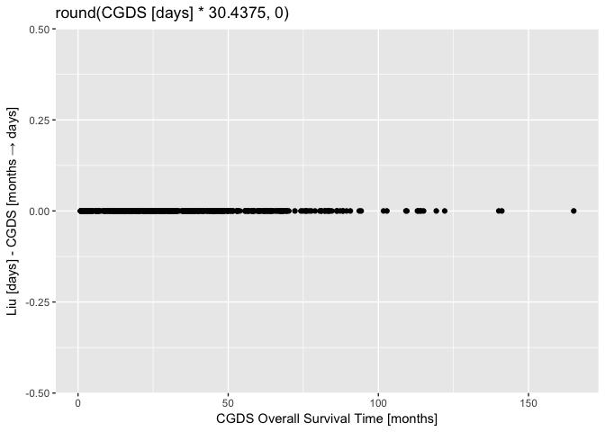
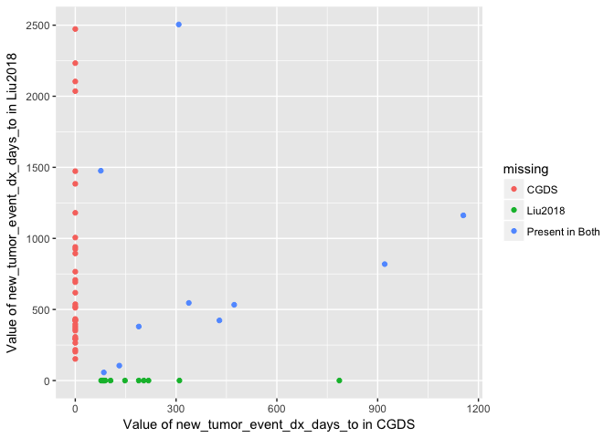

Comparing TCGA PRAD Data: CGDS vs Liu2018
================
Gerke Lab, Moffitt Cancer Center
Friday, Jul 06, 2018

## Load Data

``` r
library(tidyverse)
library(different)
```

The data come from **CGDS** – [cBioPortal (TCGA,
Provisional)](http://www.cbioportal.org/study?id=prad_tcga#summary) –
and **Liu2018** – [Liu et. al., Cell
(2018)](https://doi.org/10.1016/j.cell.2018.02.052).

Both are reproduced in
[github.com/gerkelab/TCGApipelines](https://github.com/GerkeLab/TCGApipelines).

``` r
tcga_liu2018 <- readRDS(here::here("data/tcga-liu2018_clinData.rds"))
tcga_cgds <- readRDS(here::here("data/tcga-cgds_prad.rds"))
```

**Liu2018** contains multiple cancer types, so we need to filter down to
`"PRAD"`.

``` r
tcga_liu2018 <- filter(tcga_liu2018, type == "PRAD")
```

Quick look at the dimensions of both datasets.

``` r
list(
   Liu2018 = tcga_liu2018,
   CGDS = tcga_cgds
) %>% 
   purrr::map(~ setNames(dim(.), c("Rows", "Columns"))) %>% 
   purrr::transpose() %>% purrr::transpose() %>% 
   purrr::map_dfr(~ ., .id = "Set")
```

    ## # A tibble: 2 x 3
    ##   Set      Rows Columns
    ##   <chr>   <int>   <int>
    ## 1 Liu2018   500      33
    ## 2 CGDS      499      80

## Match ID Column

The columns containing IDs have different column names and format, so we
first need to standardize name and format so that we can match patients
from **CGDS** to those in **Liu2018**.

``` r
tcga_liu2018 %>% slice(1:5) %>% select(bcr_patient_barcode)
```

    ## # A tibble: 5 x 1
    ##   bcr_patient_barcode
    ##   <chr>              
    ## 1 TCGA-2A-A8VL       
    ## 2 TCGA-2A-A8VO       
    ## 3 TCGA-2A-A8VT       
    ## 4 TCGA-2A-A8VV       
    ## 5 TCGA-2A-A8VX

``` r
tcga_cgds %>% slice(1:5) %>% select(id)
```

    ## # A tibble: 5 x 1
    ##   id             
    ##   <chr>          
    ## 1 TCGA.V1.A9OQ.01
    ## 2 TCGA.V1.A8MK.01
    ## 3 TCGA.XK.AAJT.01
    ## 4 TCGA.EJ.5502.01
    ## 5 TCGA.YJ.A8SW.01

In general, it seems that **Liu2018** drops the trailing `.NN` and
replaces `.` with `-` characters. Here’s a quick function that
transforms the IDs.

``` r
cgds_to_liu2018_id <- function(ids) {
   ids <- str_remove(ids, "\\.\\d{2}$")
   str_replace_all(ids, "\\.", "-")
}
```

Verify this function gives thes same format for both IDs.

``` r
tcga_liu2018$bcr_patient_barcode[1]
```

    ## [1] "TCGA-2A-A8VL"

``` r
cgds_to_liu2018_id(tcga_cgds$id[1])
```

    ## [1] "TCGA-V1-A9OQ"

### Trailing `.NN` in CGDS

The IDs in the **CGDS** dataset contain a trailing `.NN`. Are these
always `.01`?

``` r
tcga_cgds %>% 
   select(id) %>% 
   mutate(`Trailing Digits` = str_extract(id, "\\d{2}$")) %>% 
   group_by(`Trailing Digits`) %>% 
   count() %>% 
   knitr::kable()
```

| Trailing Digits |   n |
| :-------------- | --: |
| 01              | 498 |
| 06              |   1 |

Which ID ends with `.06`?

``` r
cgds_odd_id <- tcga_cgds %>% 
   filter(str_detect(id, "06$")) %>% 
   pull(id)

cgds_odd_id
```

    ## [1] "TCGA.V1.A9O5.06"

Is this ID otherwise unique?

``` r
cgds_odd_data <- tcga_cgds %>% 
   filter(str_detect(id, str_remove(cgds_odd_id, "\\.\\d{2}$"))) %>% 
   select(1:10)

knitr::kable(cgds_odd_data)
```

| id              | age | biochemical\_recurrence\_indicator | bone\_scan\_result | cancer\_type    | cancer\_type\_detailed  | cause\_of\_death\_source | clin\_m\_stage | clin\_t\_stage | ct\_scan\_ab\_pelvis\_indicator |
| :-------------- | --: | :--------------------------------- | :----------------- | :-------------- | :---------------------- | :----------------------- | :------------- | :------------- | :------------------------------ |
| TCGA.V1.A9O5.06 |  64 | YES                                |                    | Prostate Cancer | Prostate Adenocarcinoma |                          | M0             | T2b            | YES                             |
| TCGA.V1.A9O5.01 |  64 | YES                                |                    | Prostate Cancer | Prostate Adenocarcinoma |                          | M0             | T2b            | YES                             |

Are there differences in this data?

``` r
different::tidy_diff(cgds_odd_data[1, ], cgds_odd_data[2, ])
```

    ## Showing differences in 1 columns...
    ## 
    ## # A tibble: 2 x 3
    ##   variable set   `1`            
    ##   <chr>    <chr> <chr>          
    ## 1 id       x     TCGA.V1.A9O5.06
    ## 2 id       y     TCGA.V1.A9O5.01

The only difference in the **CGDS** data between the patients with these
IDs is the ID itself. Does this ID appear in the **Liu2018** data?

``` r
tcga_liu2018 %>% 
   filter(bcr_patient_barcode %in% cgds_to_liu2018_id(cgds_odd_id)) %>% 
   select(1:5) %>%
   knitr::kable()
```

| bcr\_patient\_barcode | type | age\_at\_initial\_pathologic\_diagnosis | gender | race              |
| :-------------------- | :--- | --------------------------------------: | :----- | :---------------- |
| TCGA-V1-A9O5          | PRAD |                                      64 | MALE   | \[Not Available\] |

Okay, so we’ll drop the duplicated patient from CGDS with the `.06` ID.

``` r
tcga_cgds <- tcga_cgds %>%
   filter(id != cgds_odd_id)
```

### Match CGDS IDs to Liu2018

``` r
tcga_cgds <- tcga_cgds %>%
   mutate(id = cgds_to_liu2018_id(id)) %>% 
   rename(bcr_patient_barcode = id)
```

**Liu2018** contains two additional participants not included in the
**CGDS** dataset:

``` r
tcga_liu2018 %>% 
   filter(!bcr_patient_barcode %in% tcga_cgds$bcr_patient_barcode) %>% 
   select(bcr_patient_barcode, type, last_contact_days_to) %>% 
   knitr::kable()
```

| bcr\_patient\_barcode | type | last\_contact\_days\_to |
| :-------------------- | :--- | ----------------------: |
| TCGA-HC-7741          | PRAD |                    2725 |
| TCGA-HC-8212          | PRAD |                    2179 |

So we’ll remove those patients for the remainder of this comparison.

``` r
tcga_liu2018 <- tcga_liu2018 %>%
   filter(bcr_patient_barcode %in% tcga_cgds$bcr_patient_barcode)
```

## First look at differences

First, we arrange both datasets by ID so that their rows are aligned.

``` r
tcga_cgds <- arrange(tcga_cgds, bcr_patient_barcode)
tcga_liu2018 <- arrange(tcga_liu2018, bcr_patient_barcode)
```

From here, we’ll use a package we are currently developing for comparing
and resolving the differences between data sets, called `different`.

We’ll use this package for a first look at the differences between
**CGDS** and **Liu2018** and then we’ll try to resolve these differences
by uncovering the steps required to transform **CGDS** to be as close as
possible to **Liu2018**.

``` r
tcga_diff <- tidy_diff(tcga_cgds, tcga_liu2018)

summary(tcga_diff)
```

    ## ── Comparison Summary ──────────────────────────────────────────────────────────────────────────
    ## ● Dimensions
    ##     set           rows  cols
    ##   1 tcga_cgds      498    80
    ##   2 tcga_liu2018   498    33
    ## 
    ## ● 'tcga_cgds' has 73 unique columns: `age`, `biochemical_recurrence_indicator...
    ## ● 'tcga_liu2018' has 26 unique columns: `type`, `age_at_initial_pathologic_di...
    ## ● 'tcga_cgds' and 'tcga_liu2018' have differing data types in 1 column:
    ##     column                     tcga_cgds tcga_liu2018
    ##   1 initial_pathologic_dx_year integer   numeric     
    ## 
    ## ● There are 1235 differing values across 498 rows:
    ##      variable                         state    miss_count `misses (row id)` 
    ##    1 race                             diff            342 1, 2, 3, 4, 5, 6,…
    ##    2 residual_tumor                   diff            498 1, 2, 3, 4, 5, 6,…
    ##    3 treatment_outcome_first_course   diff            270 1, 2, 3, 4, 5, 6,…
    ##    4 tumor_status                     diff            125 3, 6, 7, 23, 28, …
    ##    5 bcr_patient_barcode              same              0 ""                
    ##    6 initial_pathologic_dx_year       same              0 ""                
    ##    7 vital_status                     same              0 ""                
    ##    8 age                              unique_x         NA ""                
    ##    9 biochemical_recurrence_indicator unique_x         NA ""                
    ##   10 bone_scan_result                 unique_x         NA ""                
    ##   # ... with 96 more rows

## Matching Columns

At this point, there are many more columns in **CGDS** and the names are
not the same for most of these. The 7 columns with the same names were
automatically matched. The remaining columns were matched via rules that
were generated by comparing columns by hand, by visually inspecting
values, etc.

``` r
source(here::here("docs/compare-cgds-vs-liu2018/match_rules.R"))
match_rules
```

    ## # A tibble: 19 x 3
    ##    liu2018                             cgds              merged           
    ##    <chr>                               <chr>             <chr>            
    ##  1 bcr_patient_barcode                 bcr_patient_barc… bcr_patient_barc…
    ##  2 type                                cancer_type       type             
    ##  3 age_at_initial_pathologic_diagnosis age               age_at_initial_p…
    ##  4 gender                              sex               gender           
    ##  5 race                                race              race             
    ##  6 clinical_stage                      clin_t_stage      clinical_stage   
    ##  7 histological_type                   histological_dia… histological_type
    ##  8 initial_pathologic_dx_year          initial_patholog… initial_patholog…
    ##  9 birth_days_to                       days_to_birth     birth_days_to    
    ## 10 vital_status                        vital_status      vital_status     
    ## 11 tumor_status                        tumor_status      tumor_status     
    ## 12 last_contact_days_to                days_to_last_fol… last_contact_day…
    ## 13 death_days_to                       days_to_death     death_days_to    
    ## 14 cause_of_death                      patient_death_re… cause_of_death   
    ## 15 new_tumor_event_dx_days_to          days_to_biochemi… new_tumor_event_…
    ## 16 treatment_outcome_first_course      treatment_outcom… treatment_outcom…
    ## 17 residual_tumor                      residual_tumor    residual_tumor   
    ## 18 OS                                  os_status         OS               
    ## 19 OS.time                             os_months         OS.time

Two datasets are then created that match the “overlap” between the
original datasets. The matched datasets now have the same number of
columns, the same column names and the same number of rows.

``` r
tcga_liu2018_matched <- tcga_liu2018[, match_rules$liu2018]
colnames(tcga_liu2018_matched) <- match_rules$merged

tcga_cgds_matched <- tcga_cgds[, match_rules$cgds]
colnames(tcga_cgds_matched) <- match_rules$merged

tcga_diff <- tidy_diff(tcga_cgds_matched, tcga_liu2018_matched)
summary(tcga_diff)
```

    ## ── Comparison Summary ──────────────────────────────────────────────────────────────────────────
    ## ● Dimensions
    ##     set                   rows  cols
    ##   1 tcga_cgds_matched      498    19
    ##   2 tcga_liu2018_matched   498    19
    ## 
    ## ● 'tcga_cgds_matched' and 'tcga_liu2018_matched' have the same 19 columns: `b...
    ## ● 'tcga_cgds_matched' and 'tcga_liu2018_matched' have differing data types in 7 columns:
    ##     column                              tcga_cgds_matched tcga_liu2018_matc…
    ##   1 age_at_initial_pathologic_diagnosis integer           numeric           
    ##   2 initial_pathologic_dx_year          integer           numeric           
    ##   3 birth_days_to                       integer           numeric           
    ##   4 last_contact_days_to                integer           numeric           
    ##   5 death_days_to                       integer           numeric           
    ##   6 new_tumor_event_dx_days_to          integer           numeric           
    ##   7 OS                                  character         numeric           
    ## 
    ## ● There are 4615 differing values across 498 rows:
    ##      variable                            state miss_count `misses (row id)` 
    ##    1 type                                diff         498 1, 2, 3, 4, 5, 6,…
    ##    2 gender                              diff         498 1, 2, 3, 4, 5, 6,…
    ##    3 race                                diff         342 1, 2, 3, 4, 5, 6,…
    ##    4 clinical_stage                      diff         498 1, 2, 3, 4, 5, 6,…
    ##    5 tumor_status                        diff         125 3, 6, 7, 23, 28, …
    ##    6 last_contact_days_to                diff         339 2, 3, 5, 7, 8, 9,…
    ##    7 death_days_to                       diff           2 309, 315          
    ##    8 cause_of_death                      diff         494 1, 2, 3, 4, 5, 6,…
    ##    9 new_tumor_event_dx_days_to          diff          55 17, 23, 38, 41, 5…
    ##   10 treatment_outcome_first_course      diff         270 1, 2, 3, 4, 5, 6,…
    ##   11 residual_tumor                      diff         498 1, 2, 3, 4, 5, 6,…
    ##   12 OS                                  diff         498 1, 2, 3, 4, 5, 6,…
    ##   13 OS.time                             diff         498 1, 2, 3, 4, 5, 6,…
    ##   14 bcr_patient_barcode                 same           0 ""                
    ##   15 age_at_initial_pathologic_diagnosis same           0 ""                
    ##   16 histological_type                   same           0 ""                
    ##   17 initial_pathologic_dx_year          same           0 ""                
    ##   18 birth_days_to                       same           0 ""                
    ##   19 vital_status                        same           0 ""

But there are still a lot of differences between the two datasets. Each
point below indicates a miss between the two – i.e. a value that is not
the same in both data sets.

``` r
plot(tcga_diff)
```

<!-- -->

## Transformations

As seen in the previous plot, there are 7 columns that are completely
different across all or nearly all observations. This is most likely the
result of recoding categorical variables (e.g. `1` vs `Deceased`) or of
a difference in units (e.g. *months* vs *days*).

The plot below compares the values of a column from **CGDS** to its
corresponding value in **Liu2018** when they are not the same in both.

<!-- -->

### Convert Months to Days

Of the variables that are completely different one results from a
scaling difference.

``` r
OS.time_lm <- tcga_diff$tidy$OS.time %>% lm(value.y ~ value.x, data = .)
OS.time_lm
```

    ## 
    ## Call:
    ## lm(formula = value.y ~ value.x, data = .)
    ## 
    ## Coefficients:
    ## (Intercept)      value.x  
    ##    0.007613    30.439908

Looks like this is a result of converting overall survival time from
months (decimal) to days (integer). Here’s the first search result for
*how to convert months to days*.


Rounding like this is destructive, so we can only modify the value
expressed in months (as a decimal) to be able to compare with the number
of days (integer).

Once we make this transformation, all differences in our data
dissappear.

<!-- -->

After review, this change is made to the **CGDS** data.

``` r
tcga_cgds_matched <- tcga_cgds_matched %>%
  mutate(OS.time = round(OS.time * 30.4375, 0))
```

### Categorical Transformations

Now we can convert the categorical differences. Here are three examples
of the recoding that takes place.

#### `type`

| Value in Liu2018 | Value in CGDS   | n   |
| :--------------- | :-------------- | :-- |
| PRAD             | Prostate Cancer | 498 |

#### `gender`

| Value in Liu2018 | Value in CGDS | n   |
| :--------------- | :------------ | :-- |
| MALE             | Male          | 498 |

#### `clinical_stage`

| Value in Liu2018   | Value in CGDS | n   |
| :----------------- | :------------ | :-- |
| \[Not Applicable\] |               | 91  |
| \[Not Applicable\] | \[Unknown\]   | 1   |
| \[Not Applicable\] | T1a           | 1   |
| \[Not Applicable\] | T1b           | 2   |
| \[Not Applicable\] | T1c           | 175 |
| \[Not Applicable\] | T2            | 13  |
| \[Not Applicable\] | T2a           | 56  |
| \[Not Applicable\] | T2b           | 54  |
| \[Not Applicable\] | T2c           | 50  |
| \[Not Applicable\] | T3a           | 36  |
| \[Not Applicable\] | T3b           | 17  |
| \[Not Applicable\] | T4            | 2   |

The following encodes the rules to move from the **CGDS** dataset to the
**Liu2018** dataset.

``` r
tcga_cgds_matched <- tcga_cgds_matched %>%
   mutate(
      type = "PRAD",
      gender = toupper(gender),
      OS = as.integer(OS == "DECEASED"),
      race = case_when(
         race == "" ~ "[Not Available]",
         TRUE ~ race
      )
   )

tcga_liu2018_matched <- tcga_liu2018_matched %>%
  mutate(
     clinical_stage = NA,
     cause_of_death = case_when(
        vital_status == "Alive" ~ "",
        TRUE ~ cause_of_death
     )
  )
```

## Final Diff

``` r
tcga_diff <- tidy_diff(tcga_cgds_matched, tcga_liu2018_matched)
summary(tcga_diff)
```

    ## ── Comparison Summary ──────────────────────────────────────────────────────────────────────────
    ## ● Dimensions
    ##     set                   rows  cols
    ##   1 tcga_cgds_matched      498    19
    ##   2 tcga_liu2018_matched   498    19
    ## 
    ## ● 'tcga_cgds_matched' and 'tcga_liu2018_matched' have the same 19 columns: `b...
    ## ● 'tcga_cgds_matched' and 'tcga_liu2018_matched' have differing data types in 8 columns:
    ##     column                              tcga_cgds_matched tcga_liu2018_matc…
    ##   1 age_at_initial_pathologic_diagnosis integer           numeric           
    ##   2 clinical_stage                      character         logical           
    ##   3 initial_pathologic_dx_year          integer           numeric           
    ##   4 birth_days_to                       integer           numeric           
    ##   5 last_contact_days_to                integer           numeric           
    ##   6 death_days_to                       integer           numeric           
    ##   7 new_tumor_event_dx_days_to          integer           numeric           
    ##   8 OS                                  integer           numeric           
    ## 
    ## ● There are 1793 differing values across 498 rows:
    ##      variable                            state miss_count `misses (row id)` 
    ##    1 clinical_stage                      diff         498 1, 2, 3, 4, 5, 6,…
    ##    2 tumor_status                        diff         125 3, 6, 7, 23, 28, …
    ##    3 last_contact_days_to                diff         339 2, 3, 5, 7, 8, 9,…
    ##    4 death_days_to                       diff           2 309, 315          
    ##    5 cause_of_death                      diff           6 261, 309, 315, 34…
    ##    6 new_tumor_event_dx_days_to          diff          55 17, 23, 38, 41, 5…
    ##    7 treatment_outcome_first_course      diff         270 1, 2, 3, 4, 5, 6,…
    ##    8 residual_tumor                      diff         498 1, 2, 3, 4, 5, 6,…
    ##    9 bcr_patient_barcode                 same           0 ""                
    ##   10 type                                same           0 ""                
    ##   11 age_at_initial_pathologic_diagnosis same           0 ""                
    ##   12 gender                              same           0 ""                
    ##   13 race                                same           0 ""                
    ##   14 histological_type                   same           0 ""                
    ##   15 initial_pathologic_dx_year          same           0 ""                
    ##   16 birth_days_to                       same           0 ""                
    ##   17 vital_status                        same           0 ""                
    ##   18 OS                                  same           0 ""                
    ##   19 OS.time                             same           0 ""

## Final Differences Report

### Omissions

The `clinical_stage` and `residual_tumor` columns were included in the
Liu2018 dataset, but the values were replaced with `[Not Applicable]`.

### Transformations

The following columns were transformed from their original presentation
in **CGDS** to **Liu2018** via the transformations listed below.

  - `os_months` was converted to `OS.time` by multiplying by 30.4375 and
    rounding to the nearest integer.
  - `cancer_type` was renamed `type` and replaced with the short form
    `PRAD`
  - `sex` was renamed `gender` and made uppercase
  - `os_status` was renamed `OS` and coded as an integer where `1 ==
    "DECEASED"`
  - `race` was coded as `"[Not Available]"` if not supplied in the CGDS
    dataset
  - `patient_death_reason` was renamed `cause_of_death` and was coded as
    `"[Not Availble]"` when blank in the original dataset (including for
    patients who were still alive)

### Updates

The following variables were updated in the Liu2018 dataset.

``` r
blank_or_missing <- function(x) {
   x[x == ""] <- "*blank*"
   x[x == " "] <- "*blank*"
   x[is.na(x)] <- "*missing*"
   x
}
```

#### `last_contact_days_to`

It’s really not clear to me how this was updated.

<!-- -->

#### `treatment_outcome_first_course`

Liu2018 appears to have updated a large number of the values that were
previously blank in CGDS.

| Value in Liu2018            | Value in CGDS | n   |
| :-------------------------- | :------------ | :-- |
| \[Discrepancy\]             | *blank*       | 4   |
| \[Not Applicable\]          | *blank*       | 7   |
| \[Not Available\]           | *blank*       | 24  |
| \[Unknown\]                 | *blank*       | 27  |
| Complete Remission/Response | *blank*       | 176 |
| Partial Remission/Response  | *blank*       | 10  |
| Progressive Disease         | *blank*       | 14  |
| Stable Disease              | *blank*       | 8   |

#### `tumor_status`

Similarly, tumor status was updated as well.

| Value in Liu2018 | Value in CGDS | n  |
| :--------------- | :------------ | :- |
| \[Discrepancy\]  | *blank*       | 4  |
| \[Discrepancy\]  | TUMOR FREE    | 1  |
| TUMOR FREE       | *blank*       | 21 |
| TUMOR FREE       | WITH TUMOR    | 22 |
| WITH TUMOR       | *blank*       | 7  |
| WITH TUMOR       | TUMOR FREE    | 11 |
| *missing*        | *blank*       | 59 |

#### `cause_of_death`

| Value in Liu2018  | Value in CGDS | n |
| :---------------- | :------------ | :- |
| \[Not Available\] | *blank*       | 2 |
| \[Unknown\]       | *blank*       | 4 |

#### `death_days_to`

| Value in Liu2018 | Value in CGDS | n |
| :--------------- | :------------ | :- |
| 2469             | *missing*     | 1 |
| 3502             | *missing*     | 1 |

#### `new_tumor_event_dx_days_to`

Values missing in CGDS are at y-axis, values missing in Liu2018 are on
x-axis.

<!-- -->
